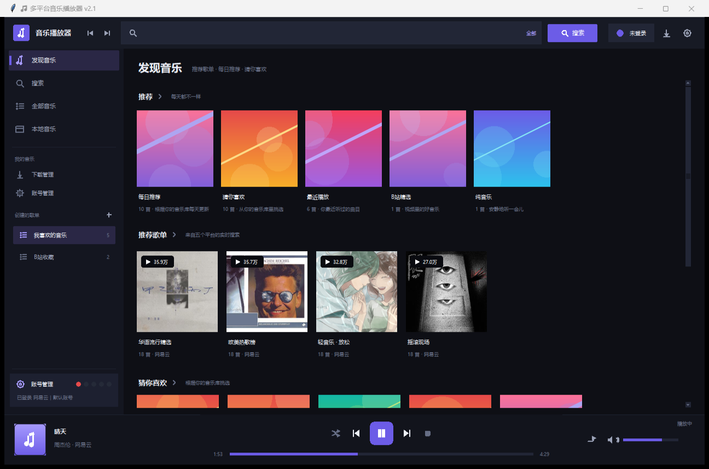
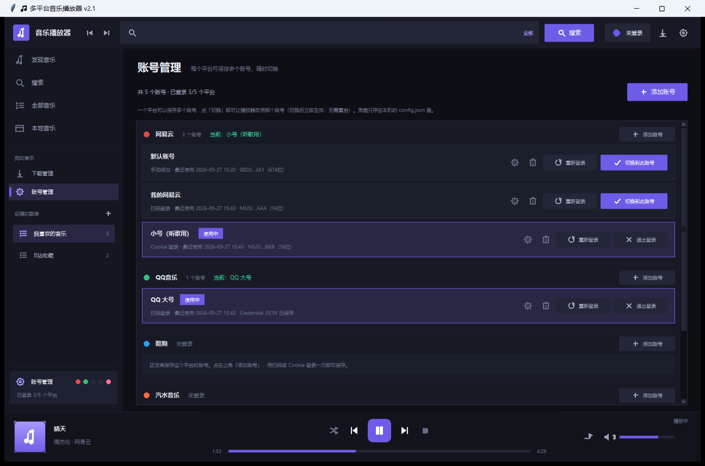
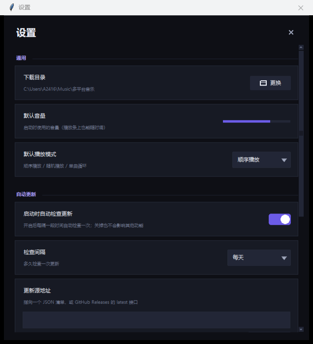

# 多平台音乐播放器

聚合 **网易云 / QQ音乐 / 酷狗 / 汽水音乐 / B站** 五个平台的搜索、播放与下载，
界面参照网易云音乐 PC 端的布局：顶部搜索栏 + 左侧导航 + 首页推荐流 + 底部播放条。



## 功能

### 界面布局
- **顶部**：后退 / 前进、搜索框（可切换搜索范围）、账号状态、下载、设置
- **左侧**：发现音乐 / 搜索 / 全部音乐 / 本地音乐、我的音乐、创建的歌单
- **首页**：一排分类卡片（每日推荐 / 猜你喜欢 / 最近播放 / B站精选 / 纯音乐）

  + 「推荐歌单」横向卡片流（带播放量角标）+「猜你喜欢」网格
- **播放条**：封面、歌名（跑马灯）、播放控制、进度条、音量、播放模式
- 卡片封面来自各平台真实封面（自动下载并缓存），没有封面的平台
  （酷狗 / 汽水）会用「标题+歌手」生成一张确定性的渐变几何封面

### 账号管理（一个平台可存多个账号）
- 侧边栏「账号管理」页集中展示**每个平台登录了没有、当前用的是哪个账号**
  （底部还有 5 个状态圆点，绿=已登录，灰=未登录）
- **一个平台可以保存多个账号**，点「切换到此账号」立即生效，无需重启
- 卡片上显示：账号名、登录方式、最近使用时间、凭据打码预览
- 支持 **添加账号 / 切换 / 重命名 / 删除 / 退出登录 / 重新登录**
- 凭据只存在本机 `config.json`，不会上传；旧版单账号配置会**自动迁移**成一条账号记录



### 自动更新（可在设置里开关）
- 顶部齿轮 → 设置 → **自动更新**，里面有开关、检查间隔、更新源
- 支持两种更新源格式：
  - 自己的 JSON 清单：`{"version": "2.1.0", "notes": "...", "url": "..."}`
  - GitHub Releases API：`https://api.github.com/repos/用户/仓库/releases/latest`
- 开关：**启动时自动检查更新**（默认开），间隔可选 每次启动 / 6 小时 / 12 小时 /
  每天 / 3 天 / 每周；也能在设置里点「立即检查」
- 发现新版本会弹提示，并可在设置里直接下载
- 打包成 exe 时支持下载后**自替换并重启**；源码运行时会打开下载目录由你手动替换



### 搜索与播放
- **跨平台搜索**：一次输入，同时检索全部（或指定）平台，结果汇总到同一列表
- **播放控制**：播放 / 暂停 / 继续 / 停止，进度条任意拖动跳转，音量 0–100% 实时调节
- **播放缓存**：同一个地址只下载一次，重复播放、拖动进度都是秒响应
- **格式兜底**：pygame 解不了的格式（部分 flac/m4a）自动调用 ffmpeg 转码，
  把 `ffmpeg.exe` 放根目录就会自动识别（详见「ffmpeg」一节）
- **B站音频**：按视频搜索，自动挑选最高码率的 dash 音频流播放

### 播放列表
- **创建 / 改名 / 复制 / 删除**播放列表，全部自动保存到 `playlists.json`，重启不丢
- **加入方式**：右键菜单「加入播放列表」、新建时直接加入、**从列表拖拽曲目到左侧歌单**
- **播放**：播放全部 / 随机播放；列表中可上移下移、移除单曲
- **导出**：一键导出 `.m3u` 播放列表

### 播放模式（点播放条上的图标循环切换）
| 模式 | 图标 | 行为 |
| --- | --- | --- |
| 顺序播放 | ⇉ | 按列表顺序播放，**播完整个列表即停** |
| 随机播放 | ⤨ | 打乱顺序播放，一轮覆盖全部曲目后**播完即停** |
| 单曲循环 | ↻1 | 一直重复当前这一首 |

> 列表只有一首歌时，行为等同于单曲循环。

### 批量下载
- 搜索结果 / 歌单里可**多选后批量下载**，也可「下载整个歌单」
- 两个下载线程并行，实时显示**总进度、已下载体积、速度**，可取消 / 重试 / 移除
- 下载完成后自动写入 ID3 标签（需要 `mutagen`，属于可选依赖）
- 已下载的曲目在列表里显示为绿色，之后播放**直接读本地文件**，不再联网
- 下载目录可在「设置」或「下载管理」里随时更换，「本地音乐」页可扫描这些文件

### 快捷键
| 按键 | 作用 |
| --- | --- |
| `Enter` | 播放选中曲目 |
| `Space` | 播放 / 暂停 |
| `Ctrl + F` | 定位到搜索框 |
| `Ctrl + N` | 新建播放列表 |
| `Delete` | 在歌单中移除选中曲目 |
| `Esc` | 停止播放 |


## 目录结构

```
music_player/
├─ main_gui.py          # 图形界面入口（推荐）
├─ app_gui.py           # 界面主体：顶部搜索栏 / 侧边栏 / 首页 / 各功能页 / 播放条
├─ cards.py             # 首页卡片控件（封面卡片、横向卡片流、播放量角标）
├─ cover.py             # 封面：异步下载 + 磁盘缓存 + 程序化兜底封面
├─ feed.py              # 首页内容：每日推荐 / 猜你喜欢 / 推荐歌单（带缓存）
├─ updater.py           # 自动更新：版本比对、更新源解析、下载与自替换
├─ settings_dialog.py   # 设置窗口（含自动更新开关）
├─ accounts.py          # 多账号管理：一个平台存多个账号、切换、迁移旧配置
├─ theme.py             # 设计系统：配色、字体、ttk 主题（改这一个文件即可换肤）
├─ icons.py             # Canvas 矢量图标（播放 / 随机 / 单曲循环 / 音量 …）
├─ widgets.py           # 自绘控件：圆角按钮、开关、进度条、滑杆、Toast、对话框
├─ tray.py              # 曲目模型 + 播放列表存储（playlists.json 原子读写）
├─ play_queue.py        # 播放队列与播放模式（顺序 / 随机 / 单曲循环）
├─ downloader.py        # 批量下载队列（进度、标签、回写本地路径）
├─ player.py            # 播放引擎：下载缓存 → 解码播放，ffmpeg 兜底，支持 seek
├─ main.py              # 命令行入口
├─ login_dialog.py      # 登录对话框（二维码 / 手机号 / Cookie）
├─ config.py            # 配置读写（缺省键自动补齐，旧配置自动迁移）
├─ config.json          # 本地登录凭证与偏好（已 gitignore，不入库）
├─ playlists.json       # 本地播放列表数据（已 gitignore，不入库）
├─ feed_cache.json      # 首页推荐内容缓存（已 gitignore，不入库）
├─ config.example.json  # 配置模板
├─ requirements.txt     # 运行依赖
├─ selftest.py          # 无头自检：账号 / 播放模式 / 更新逻辑 / 首页内容 / 界面
├─ platforms/           # 平台适配器，统一 search / get_play_url 接口
│  ├─ netease.py        #   网易云（pyncm）
│  ├─ qqmusic.py        #   QQ音乐（qqmusic-api-python 0.7.x）
│  ├─ kugou.py          #   酷狗（移动端网页接口）
│  ├─ qishui.py         #   汽水音乐（PC 端接口）
│  └─ bilibili.py       #   B站音频（bilibili-api-python）
├─ docs/screenshots/    # README 用的界面截图
├─ 安装依赖.bat          # 一键安装依赖
├─ 启动播放器.bat        # 启动图形界面
├─ 命令行版.bat          # 启动命令行版
├─ auto-py-to-exe.json  # 打包配置（可选）
└─ ffmpeg.exe           # 可选：自己放进来，用于格式兜底转码（已 gitignore）
```

## 运行

环境要求：Windows + Python 3.11（3.9 及以上理论可用）。

**方式一：双击脚本（推荐给不熟悉命令行的场景）**

1. 双击 `安装依赖.bat` —— 自动挑选 Python、升级 pip、安装全部依赖并验证导入
2. 双击 `启动播放器.bat` —— 打开图形界面
3. 双击 `命令行版.bat` —— 打开命令行界面

**方式二：手动运行**

```bat
py -3.11 -m pip install -r requirements.txt
py -3.11 main_gui.py
```

**自检**（不联网、不出声，只验证逻辑与界面能否构建）：

```bat
py -3.11 selftest.py
```

> 自检会临时把真实的 `config.json` / `playlists.json` 挪开，跑完自动还原，
> 不会破坏你的登录状态和歌单。

命令行版支持的命令：

```
search <关键词>        跨平台搜索音乐
bili <关键词>          搜索 B 站视频
play <平台> <索引>     播放搜索结果，如 play netease 0
playbili <bvid>        播放 B 站视频音频
login                  配置登录信息
quit                   退出
```

## 登录与凭证

登录信息统一保存在 `config.json`，由界面左下角「账号管理」或「账号登录」写入，
保存后客户端会**热重载**，无需重启程序。

每个平台可以保存**多个账号**，结构如下（由 `accounts.py` 维护）：

```json
"netease": {
  "cookie": "当前账号的 MUSIC_U（兼容旧版，自动同步）",
  "accounts": [
    {"id": "39c33b5774", "label": "我的网易云", "method": "qr",
     "cred": {"cookie": "MUSIC_U=..."},
     "created_at": 1700000000, "last_used": 1700000000}
  ],
  "current": "39c33b5774"
}
```

| 平台 | 支持的登录方式 | `cred` 里存什么 |
| --- | --- | --- |
| 网易云 | 扫码 / 手机号 / Cookie | `cookie` = `MUSIC_U` 的值 |
| QQ音乐 | 扫码 / Cookie | `cookie` = Credential 的 JSON 串 |
| B站 | 扫码 / Cookie | `sessdata` + `bili_jct` |
| 酷狗 | Cookie | `cookie` |
| 汽水音乐 | Cookie | `cookie` |

> 没有 `config.json` 也能启动：`config.py` 会用默认值补齐，匿名状态下仍可搜索。
> 没有 `playlists.json` 会自动创建，删掉即恢复成「没有歌单」的初始状态。
> 旧版把凭据直接写在 `cfg['netease']['cookie']` 的配置，第一次启动时会自动迁移。

**安全提示**：`config.json` 里存的是**可用的明文登录凭证**，等同于账号登录态。
它已加入 `.gitignore`，请勿提交到仓库或分享给他人；如需重置，删除该文件即可。

## 已知限制

- **酷狗**：播放直链需要设备签名校验，公开接口无法稳定获取，`get_play_url()` 通常返回 `None`
  （搜索功能正常）。此时界面会提示无法获取播放地址，请换用其他平台。
- **汽水音乐**：返回的播放地址可能是加密内容，需要额外的解密步骤。
- **B站**：音频取的是 dash 流里码率最高的一条；部分视频需要登录（大会员）才能取到高码率。
- **格式兼容**：`pygame` 无法直接解码的格式会调用 `ffmpeg` 转成 mp3 兜底；
  未装 ffmpeg 时会提示「无法播放该格式」。ffmpeg 怎么放见下一节。
- **无音频设备**：`pygame.mixer.init()` 失败时程序不会崩溃，但无法出声。
- **保留策略**：播放缓存放在 `%TEMP%\music_player_cache`，超过 900MB 会按时间自动清理。

## ffmpeg（可选，但建议装）

ffmpeg 只在 **pygame 解不了某个格式**（部分 flac / m4a / opus）时用来兜底转码成 mp3。
mp3 正常播放不需要它。

**程序会自动按下面顺序查找 ffmpeg，找到就用，不需要配环境变量：**

1. 程序根目录下的 `ffmpeg.exe`
2. 根目录下的常见子目录：`bin\`、`ffmpeg\bin\`、`tools\ffmpeg\bin\`
3. 根目录下任何以 `ffmpeg` 开头的解压目录里的 `ffmpeg.exe` 或 `bin\ffmpeg.exe`
4. 系统 `PATH`

所以**最省事的做法**：去 <https://www.gyan.dev/ffmpeg/builds/> 下载
`ffmpeg-release-essentials.zip`，解压后把里面的 `bin\ffmpeg.exe` 复制到
本项目根目录（和 `main_gui.py` 放一起）即可。

> 注意：`ffmpeg.org` 上的 `ffmpeg-x.y.z.tar.xz` 是**源代码**，需要自己用
> `./configure && make` 编译（Windows 上还要装 MinGW/MSVC），解开后里面没有
> 任何 `.exe`，程序无法直接使用。要的是**编译好的 Windows 二进制**，
> 也就是上面 gyan.dev 或 <https://github.com/BtbN/FFmpeg-Builds/releases> 的发行包。

ffmpeg 体积较大，已在 `.gitignore` 里排除（`ffmpeg.exe` / `ffmpeg-*/` 等都不入库）。
可以在「下载管理」或启动提示里确认程序有没有找到它。

## 打包

`auto-py-to-exe.json` 是 [auto-py-to-exe](https://github.com/brentvolve/auto-py-to-exe) 的配置，
入口为 `main_gui.py`，窗口模式（`console: false`）。

注意：
- 配置中的路径是**绝对路径**，换目录或换机器后需要重新选择文件
- `app_gui.py` 用 `sys.path.insert` 自行解决模块导入，打包时把整个目录加进去即可
- 打包后 `ffmpeg.exe` 放在 **exe 同级目录**即可被自动找到（`_app_dir()` 会返回 exe 所在目录）
- 打包前请确认已安装 `pyinstaller` 与 `auto-py-to-exe`（二者不是运行依赖）
